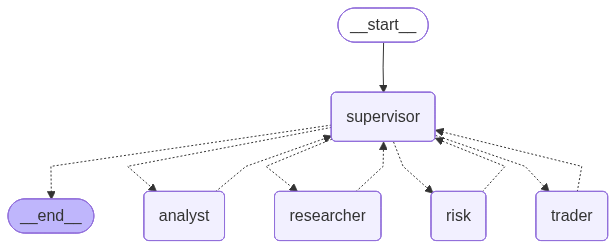
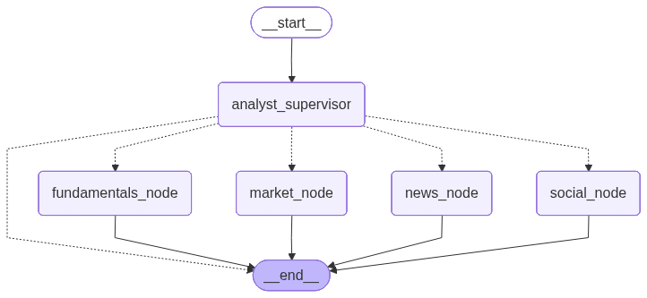
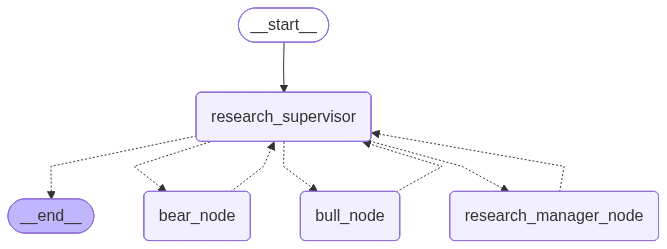
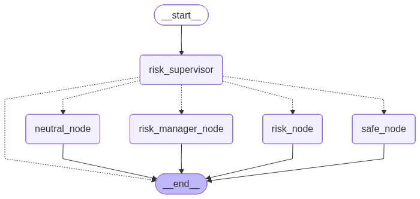

# TradeReAct: Enhanced Multi-Agent LLM Financial Trading Framework

<div align="center">
  <a href="README.md">English</a> | <a href="README_CN.md">简体中文</a>
</div>

> 🚀 **TradeReAct** is an improved version of [TradingAgents](https://github.com/TauricResearch/TradingAgents), featuring MCP (Model Context Protocol) integration, Weaviate vector database support, and optimized memory management for enhanced trading intelligence.

<div align="center">

🚀 [Features](#key-features) | 🏗️ [Architecture](#architecture) | ⚡ [Installation](#installation) | 🔧 [Configuration](#configuration) | 📦 [Usage](#usage) | 🎯 [Improvements](#improvements-over-original)

</div>

---

## Overview

TradeReAct is a multi-agent trading framework that mirrors the dynamics of real-world trading firms. By deploying specialized LLM-powered agents - from fundamental analysts, sentiment experts, and technical analysts to traders and risk management teams - the platform collaboratively evaluates market conditions and informs trading decisions.

**What makes TradeReAct different:**
- 🔌 **MCP Integration**: Connect to external data sources through the Model Context Protocol
- 🗄️ **Weaviate Vector Database**: Advanced memory system with hybrid search (BM25 + vector similarity)
- 🎯 **Flexible Configuration**: Config-driven architecture for easy customization
- 🌍 **Multi-Market Support**: Enhanced support for Chinese stock markets through MCP tools
- ⚡ **Optimized Performance**: Improved memory management and routing efficiency

> TradeReAct framework is designed for research purposes. Trading performance may vary based on many factors. [It is not intended as financial, investment, or trading advice.](https://tauric.ai/disclaimer/)

---

## Key Features

### 🏗️ Multi-Agent Architecture

> 📊 **[View Architecture Diagram](#architecture)** - LangGraph workflow graph and stage subgraphs.

Our framework decomposes complex trading tasks into specialized roles:

#### Analyst Team
- **Fundamentals Analyst**: Evaluates company financials and performance metrics with optional MCP tools for real-time data
- **Sentiment Analyst**: Analyzes social media and public sentiment using sentiment scoring algorithms
- **News Analyst**: Monitors global news and macroeconomic indicators with MCP integration for diverse sources
- **Technical Analyst**: Utilizes technical indicators (MACD, RSI, etc.) to detect trading patterns

#### Researcher Team
- Comprises both bullish and bearish researchers who critically assess analyst insights
- Engages in structured debates to balance potential gains against inherent risks
- Uses vector memory to recall relevant historical situations for informed discussion

#### Trader Agent
- Synthesizes reports from analysts and researchers to make informed trading decisions
- Determines timing and magnitude of trades based on comprehensive market insights
- Accesses historical trading memory for pattern recognition

#### Risk Management & Portfolio Manager
- Continuously evaluates portfolio risk by assessing volatility, liquidity, and risk factors
- Provides assessment reports to Portfolio Manager for final decisions
- Maintains risk memory for consistent risk evaluation standards

---

## Architecture

### Top-level LangGraph



### Stage Subgraphs







### 🔌 MCP (Model Context Protocol) Integration

TradeReAct supports MCP servers to **extend** agent capabilities with external tools **on top of existing data sources**. MCP tools are seamlessly merged with custom tools (yfinance, Alpha Vantage, etc.) to provide a unified tool interface.

**Key Benefits**:
- ✅ **Additive, not replacive**: MCP tools complement existing data sources
- ✅ **Unified interface**: All tools (custom + MCP) implement BaseTool for seamless integration
- ✅ **Configuration-driven**: Enable/disable MCP per analyst without code changes
- ✅ **Backward compatible**: Automatically falls back to custom tools if MCP is unavailable
- ✅ **Multi-market support**: Easily add region-specific data sources (e.g., Chinese A-shares)

**Example Configuration**:

```json
{
  "mcpServers": {
    "market_analyst": {
      "enabled": true,
      "description": "Provides Chinese stock market data interface",
      "servers": {
        "china-stock-mcp": {
          "url": "https://mcp.api-inference.modelscope.net/2334ad93fd4b44/mcp",
          "transport": "streamable_http"
        }
      }
    }
  }
}
```

**How It Works**:
1. **Custom Tools Loaded First**: yfinance for prices, Alpha Vantage for fundamentals/news
2. **MCP Tools Added**: Additional tools from configured MCP servers
3. **Merged Tool List**: Agent receives combined list of all available tools
4. **Agent Selection**: ReAct agent selects the most appropriate tool for each task

**Available MCP Tools (market_analyst example - 30+ tools)**:
- Historical and real-time stock data (Chinese A-shares)
- Financial statements (balance sheet, income, cash flow)
- Market analysis (fund flow, sentiment, volatility)
- Company information and shareholder data
- Valuation metrics and research reports
- Index data and market statistics

> 📊 See [Architecture Diagrams](docs/architecture_diagram.md) for visual representation of MCP tool loading and merging process.

### 🗄️ Weaviate Vector Database

Enhanced memory system with:
- **Hybrid Search**: Combines BM25 keyword search with vector similarity (configurable alpha parameter)
- **5 Specialized Collections**: Separate memories for bull/bear researchers, traders, analyst subgraph, and risk management
- **Persistent Storage**: Local or cloud-based Weaviate instances
- **Semantic Understanding**: Better context retrieval for agent decision-making

---

## Installation

### Prerequisites

- Python 3.10+
- Conda or virtual environment manager
- Weaviate (embedded mode works out of the box, or configure local/cloud instance)

### Clone Repository

```bash
git clone https://github.com/RabbitAndAir/TradeReAct.git
cd TradeReAct
```

### Create Virtual Environment

```bash
conda create -n tradereact python=3.10
conda activate tradereact
```

### Install Dependencies

```bash
pip install -U langchain langgraph langchain-openai weaviate-client typer rich python-dotenv questionary
```

### Required API Keys

You'll need:
- **OpenAI API**: For LLM agents
- **Alpha Vantage API** (optional): For fundamental and news data (get free key [here](https://www.alphavantage.co/support/#api-key))

Create a `.env` file in the project root:

```bash
cp .env.example .env
# Edit .env with your actual API keys
```

Example `.env`:
```bash
OPENAI_API_KEY=your_openai_api_key_here
ALPHA_VANTAGE_API_KEY=your_alpha_vantage_api_key_here
# Optional: Custom OpenAI endpoint
OPENAI_BASE_URL=https://api.openai.com/v1
```

---

## Configuration

### Default Configuration

Edit [tradereact/default_config.py](tradereact/default_config.py) to customize:

```python
DEFAULT_CONFIG = {
    # LLM settings
    "deep_think_llm": "o4-mini",        # Reasoning model
    "quick_think_llm": "gpt-4o-mini",   # Fast model

    # Debate settings
    "max_debate_rounds": 1,
    "max_risk_discuss_rounds": 1,

    # Data vendors
    "data_vendors": {
        "core_stock_apis": "yfinance",
        "technical_indicators": "yfinance",
        "fundamental_data": "alpha_vantage",
        "news_data": "alpha_vantage",
    },

    # Weaviate configuration (coming soon)
    "weaviate": {
        "host": "localhost",
        "port": 50051,
        "use_embedded": True,  # Set to False for local instance
    }
}
```

### MCP Configuration

Create and edit `mcp_config.json` (this file is ignored by git) to configure MCP servers for specific analysts:

```json
{
  "mcpServers": {
    "market_analyst": {
      "enabled": true,
      "description": "Your MCP server description",
      "servers": {
        "your-mcp-server": {
          "url": "your-mcp-server-url",
          "transport": "streamable_http"
        }
      }
    }
  }
}
```

**Testing MCP Configuration**:
```bash
python -m tradereact.agents.utils.mcp_loader
```

---

## Usage

### Python API

Basic usage:

```python
from tradereact.graph.trading_graph import TradingAgentsGraph
from tradereact.default_config import DEFAULT_CONFIG

# Initialize graph
ta = TradingAgentsGraph(debug=True, config=DEFAULT_CONFIG.copy())

# Run trading analysis
_, decision = ta.propagate("NVDA", "2024-05-10")
print(decision)
```

Custom configuration:

```python
from tradereact.graph.trading_graph import TradingAgentsGraph
from tradereact.default_config import DEFAULT_CONFIG

# Create custom config
config = DEFAULT_CONFIG.copy()
config["deep_think_llm"] = "gpt-4o"
config["quick_think_llm"] = "gpt-4o-mini"
config["max_debate_rounds"] = 2

# Configure data vendors
config["data_vendors"]["fundamental_data"] = "alpha_vantage"
config["data_vendors"]["news_data"] = "openai"

# Initialize with custom config
ta = TradingAgentsGraph(debug=True, config=config)

# Run analysis
_, decision = ta.propagate("AAPL", "2024-12-01")
print(decision)
```

### CLI Usage

```bash
python -m cli.main
```

The CLI provides an interactive interface to:
- Select tickers to analyze
- Choose analysis date
- Configure LLM models
- Set research depth
- View real-time agent progress

---

## Improvements Over Original

### 🔌 1. MCP Integration

**What it does**: Extends agent capabilities with external tools through standardized protocol

**Benefits**:
- Connect to any MCP-compatible data source
- Dynamic tool loading based on configuration
- Backward compatible (falls back to custom tools if MCP unavailable)
- Supports Chinese stock market data sources

**Implementation**: [tradereact/agents/utils/mcp_loader.py](tradereact/agents/utils/mcp_loader.py)

### 🗄️ 2. Weaviate Vector Database

**What it does**: Replaces ChromaDB with Weaviate for advanced memory management

**Benefits**:
- Hybrid search: BM25 keyword + vector similarity
- Better semantic understanding
- Configurable search parameters (alpha, limit)
- Supports local and cloud deployments
- Production-ready scalability

**Implementation**: [tradereact/agents/utils/memory.py](tradereact/agents/utils/memory.py)

### ⚡ 3. Optimized Routing

**What it does**: Reduces unnecessary analyst calls through intelligent routing

**Benefits**:
- 75% reduction in routing rounds (from 4 to 1 on average)
- Faster decision-making
- Lower API costs
- Maintained decision quality

**Implementation**: [tradereact/graph/subgraphs/analyst_subgraph.py](tradereact/graph/subgraphs/analyst_subgraph.py)

### 🎯 4. Config-Driven Architecture

**What it does**: Centralized configuration management

**Benefits**:
- Easy deployment customization
- No code changes for configuration
- Better for open-source collaboration
- Environment-specific configs

**Files**:
- [tradereact/default_config.py](tradereact/default_config.py)
- [mcp_config.json](mcp_config.json)

### 🌍 5. Multi-Market Support

**What it does**: Enhanced support for non-US markets

**Benefits**:
- Chinese stock market integration via MCP
- Extensible to other markets
- Localized data sources
- Regional analysis capabilities

---

## Project Structure

```
TradeReAct/
├── tradereact/
│   ├── agents/
│   │   ├── analysts/          # Analyst agents (4 types)
│   │   ├── researcher/        # Bull/bear researchers
│   │   ├── trader/           # Trading decision agent
│   │   ├── risk/             # Risk management team
│   │   └── utils/
│   │       ├── memory.py      # Weaviate memory system
│   │       └── mcp_loader.py  # MCP tool loader
│   ├── graph/
│   │   ├── trading_graph.py   # Main orchestrator
│   │   └── setup.py          # Graph wiring
│   ├── dataflows/             # Data fetching tools
│   └── default_config.py      # Default configuration
├── mcp_config.example.json    # MCP server configuration template
├── cli/                       # Command-line interface
└── run.sh                     # Run CLI via conda env
```

---

## System Requirements

### Minimum
- 8GB RAM
- 4 CPU cores
- 10GB disk space

### Recommended
- 16GB+ RAM
- 8+ CPU cores
- SSD storage
- GPU (optional, for local LLM inference)

---

## Testing

```bash
python -m compileall -q tradereact cli
python -m cli.main
```

This validates:
- Project structure
- Module imports
- MCP configuration
- Python syntax
- Environment variables

### Full Graph Test

```bash
python test_full_graph.py
```

Tests complete graph construction with all agents and MCP integration.

---

## Performance Optimization

### Cost Reduction
- Use `gpt-4o-mini` for quick thinking (10x cheaper than GPT-4)
- Use `o4-mini` instead of `o1-preview` for deep thinking
- Reduce `max_debate_rounds` for faster decisions
- Leverage MCP tools to reduce custom API calls

### Speed Optimization
- Use embedded Weaviate for local testing
- Enable MCP only for required analysts
- Adjust memory retrieval limits
- Use caching for repeated queries

---

## Troubleshooting

### MCP Tools Not Loading

1. Check `mcp_config.json` format
2. Verify server URL is accessible
3. Test with: `python -m tradereact.agents.utils.mcp_loader`
4. Check server `enabled` status

### Weaviate Connection Issues

1. Verify Weaviate is running (if using local instance)
2. Check port configuration
3. Try embedded mode: `"use_embedded": True`
4. Check network connectivity for cloud instances

### Memory/Performance Issues

1. Reduce memory retrieval limits in config
2. Use lighter LLM models
3. Decrease debate rounds
4. Clear Weaviate cache/collections

---

## Contributing

We welcome contributions! Areas of interest:
- Additional MCP server integrations
- New data vendor adapters
- Performance optimizations
- Documentation improvements
- Bug fixes

---

## Citation

This project builds upon the original TradingAgents framework:

```bibtex
@misc{xiao2025tradingagentsmultiagentsllmfinancial,
      title={TradingAgents: Multi-Agents LLM Financial Trading Framework},
      author={Yijia Xiao and Edward Sun and Di Luo and Wei Wang},
      year={2025},
      eprint={2412.20138},
      archivePrefix={arXiv},
      primaryClass={q-fin.TR},
      url={https://arxiv.org/abs/2412.20138},
}
```

---

## License

This project follows the same license as the original TradingAgents repository.

---

## Disclaimer

This framework is designed for research and educational purposes only. It is not intended as financial, investment, or trading advice. Trading involves significant risk, and past performance does not guarantee future results. Always conduct your own research and consult with qualified financial advisors before making investment decisions.

---

## Acknowledgments

- Original [TradingAgents](https://github.com/TauricResearch/TradingAgents) by Tauric Research
- [LangChain](https://github.com/langchain-ai/langchain) and [LangGraph](https://github.com/langchain-ai/langgraph) frameworks
- [Weaviate](https://weaviate.io/) vector database
- [Model Context Protocol](https://modelcontextprotocol.io/) by Anthropic
- Alpha Vantage for API support
